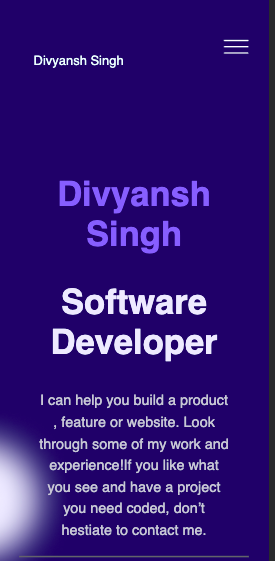

# This project is a personal portfolio.

> It is a personal portfolio with all the proffesional details about me.

## Built With

- HTML and CSS

## Live Demo

[Live Demo Link](https://divyanshthinks.github.io/Portfolio-Divyansh/)

## Getting Started

To get a local copy up and running follow these simple example steps.

### Prerequisites 
No prerequisites

### Setup
Clone the repsoitory to your local system.

### Install
Run in your code-editor.

### Usage
You can use it for viewing my professional details.

## Authors

👤 Divyansh Singh

- GitHub: [@githubhandle](https://github.com/divyanshthinks)
- Twitter: [@twitterhandle](https://twitter.com/Devilstheory1)
- LinkedIn: [LinkedIn](https://www.linkedin.com/in/divyansh-singh-a78709157/)

## 🤝 Contributing

Contributions, issues, and feature requests are welcome!

Feel free to check the [issues page](../../issues/).

## Show your support

Give a ⭐️ if you like this project!

## 📝 License

This project is [MIT](./MIT.md) licensed.

